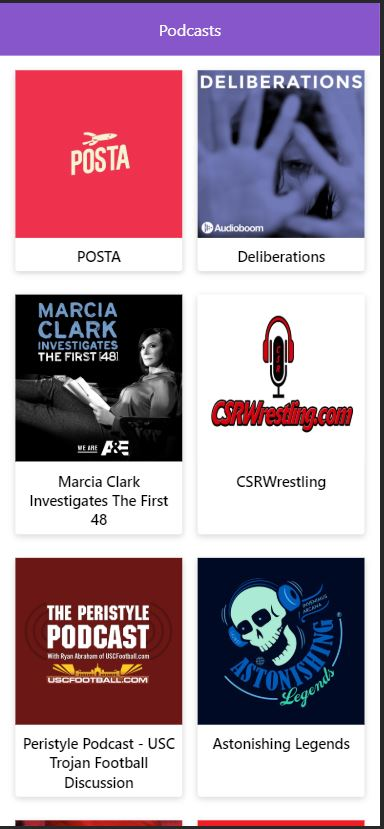

# App de Reproducción de Podcasts

Aplicación de reproducción de podcasts integrada con la API de AudioBoom para aprender los fundamentos de Next.JS

## ¿Cómo funciona?

Requiere Node.JS 10

- `npm install` para instalar las dependencias.
- `npm run dev` para el entorno de desarrollo.
- `npm run build && npm start` para el entorno de producción.

## Licencia

MIT
